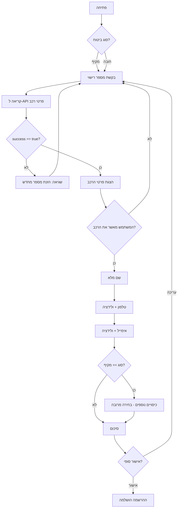

# Insurance Vehicle-Info API

A small HTTP API that, given an Israeli license plate, returns vehicle details
(manufacturer, model, year, color). This is **Part A** of the Insait home
assignment. Built with FastAPI on a hexagonal (ports & adapters) architecture
and deployed to Google Cloud Run.

**Live URL:** https://vehicle-info-api-154303237856.us-central1.run.app
· Swagger UI: [`/docs`](https://vehicle-info-api-154303237856.us-central1.run.app/docs)

---

## Demo cheat-sheet

| License plate | Result | HTTP |
|---------------|--------|------|
| `12345678`    | Success — טויוטה קורולה (Toyota Corolla) | 200 |
| `00000000`    | Not found | 404 (`VEHICLE_NOT_FOUND`) |
| `abc` / `123` | Validation error | 422 (`VALIDATION_ERROR`) |

Other seeded plates: `11111111` (יונדאי i20), `87654321` (טסלה Model 3), `22223333` (מאזדה 3).

---

## API contract

**`POST /vehicle-info`**

```json
{ "license_plate": "12345678" }
```

Success (`200`):

```json
{
  "success": true,
  "data": {
    "license_plate": "12345678",
    "manufacturer": "טויוטה",
    "model": "קורולה",
    "year": 2020,
    "color": "לבן"
  }
}
```

Error (`404` / `422` / `500`) — one unified envelope so callers branch on a single field:

```json
{
  "success": false,
  "error": { "code": "VEHICLE_NOT_FOUND", "message": "No vehicle found for license plate '00000000'." }
}
```

Error codes: `VEHICLE_NOT_FOUND` (404), `VALIDATION_ERROR` (422), `INTERNAL_ERROR` (500).

**`GET /health`** → `200 {"status": "ok"}`

---

## Requirements

- Python 3.12 (the deploy target; runs on 3.10+ locally)

## Run locally

```bash
python -m venv .venv
source .venv/bin/activate
pip install -r requirements.txt
uvicorn app.main:app --reload
```

Available at `http://127.0.0.1:8000` (Swagger at `/docs`).

## Run via Docker

```bash
docker build -t vehicle-info-api .
docker run -p 8080:8080 vehicle-info-api
```

Available at `http://127.0.0.1:8080`. The container binds `$PORT` (default 8080),
matching Cloud Run.

## Tests

```bash
pytest
```

Optional coverage (requires `pytest-cov`):

```bash
pip install pytest-cov
pytest --cov=app.domain --cov=app.application --cov-report=term-missing
```

## Environment variables

Loaded via pydantic-settings (`.env` supported). All optional:

| Variable       | Default                  | Description |
|----------------|--------------------------|-------------|
| `REPOSITORY`   | `memory`                 | Data source adapter: `memory` or `http`. |
| `UPSTREAM_URL` | _(none)_                 | Upstream registry URL; required when `REPOSITORY=http`. |
| `APP_NAME`     | `insurance-vehicle-api`  | FastAPI title (shown in `/docs`). |
| `VERSION`      | `0.1.0`                  | API version. |

## Deploy (Cloud Run)

```bash
gcloud run deploy vehicle-info-api \
  --source . --region us-central1 \
  --allow-unauthenticated --min-instances 1
```

`--allow-unauthenticated` lets the Insait webhook reach the service;
`--min-instances 1` mitigates cold-start latency.

## Example requests

```bash
URL=https://vehicle-info-api-154303237856.us-central1.run.app

# Success
curl -X POST "$URL/vehicle-info" -H 'Content-Type: application/json' \
  -d '{"license_plate":"12345678"}'

# Not found -> 404
curl -X POST "$URL/vehicle-info" -H 'Content-Type: application/json' \
  -d '{"license_plate":"00000000"}'

# Validation error -> 422
curl -X POST "$URL/vehicle-info" -H 'Content-Type: application/json' \
  -d '{"license_plate":"abc"}'

# Health
curl "$URL/health"
```

## Architecture

Hexagonal (ports & adapters). Dependencies point inward only:

```
api ─┐
     ├─► application ─► domain
infra┘                   ▲
     └───────────────────┘
```

The framework-free `domain` layer holds the `Vehicle` entity, plate-validation rules,
and the `VehicleRepository` (outbound) / `GetVehicleInfo` (inbound) ports; `application`
holds the `GetVehicleInfoUseCase`; `infrastructure` provides adapters behind the outbound
port (the default seeded `InMemoryVehicleRepository` plus an optional `HttpVehicleRepository`)
and settings; and `api` is the FastAPI surface that wires them together and normalizes every
failure into the unified envelope. Keeping the data source behind a port means it can be
swapped without touching the core. See [`docs/EXPLANATION.md`](docs/EXPLANATION.md) for the
full design rationale (Hebrew).

## Insait Flow (Part B)

The conversational flow (built in platform.insait.io) calls this API and branches on the
`success` field — on success it confirms the vehicle details, otherwise it re-prompts for
the plate.



## Screenshot checklist (for submission)

- [x] Swagger `/docs` page — [`01-swagger-success.png`](docs/screenshots/01-swagger-success.png)
- [x] A live API call (curl output or Swagger "Try it out") — [`05-terminal-edge-cases.png`](docs/screenshots/05-terminal-edge-cases.png)
- [ ] The Insait flow editor
- [ ] A full successful run (Part B conversation)
- [x] An error run (not-found / validation) — [`02`](docs/screenshots/02-not-found-edge-case.png), [`03`](docs/screenshots/03-validation-string-edge-case.png), [`04`](docs/screenshots/04-validation-too-short-edge-case.png)
