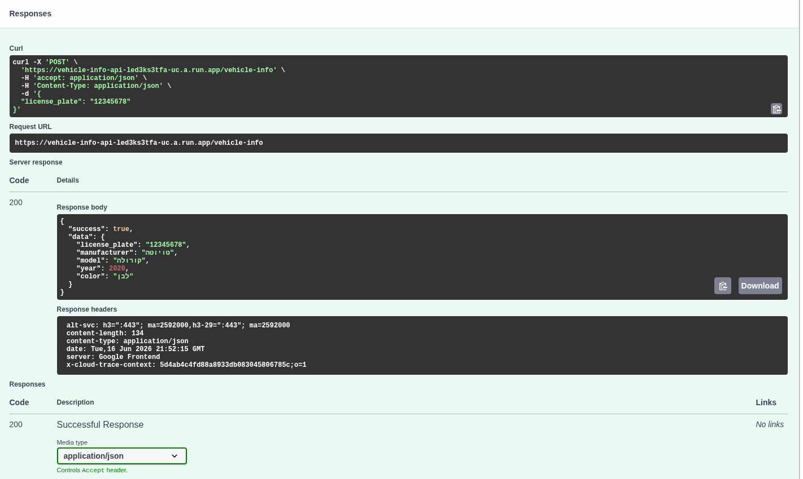
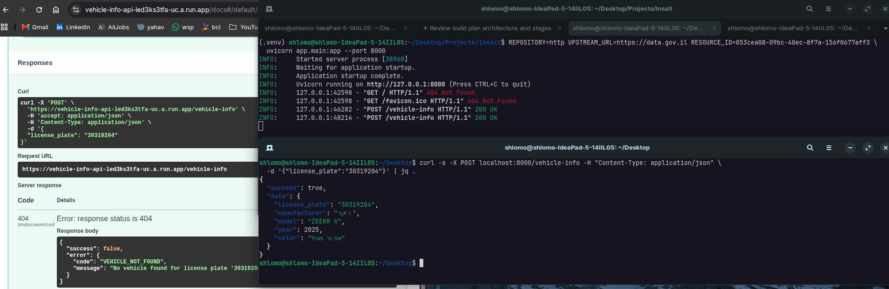
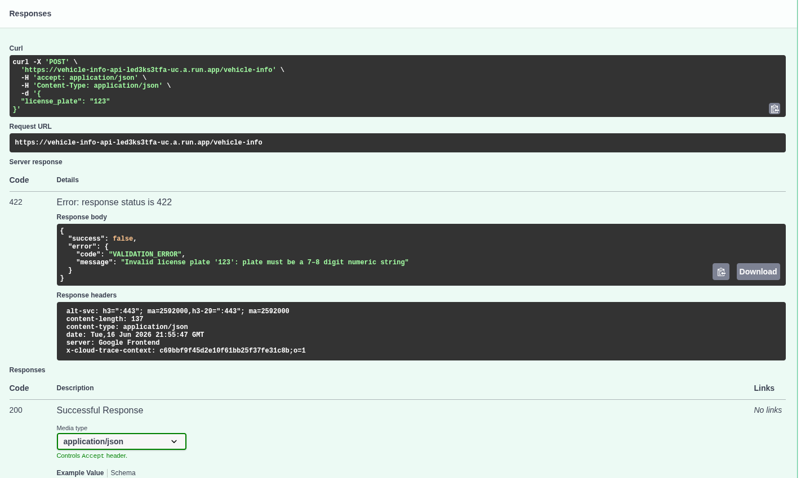
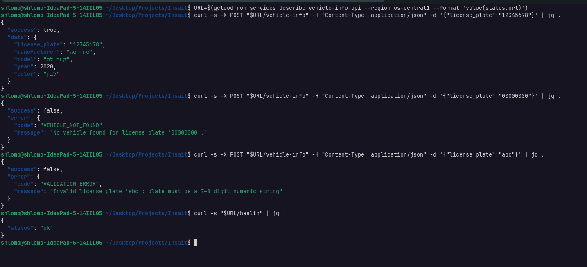
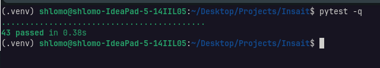
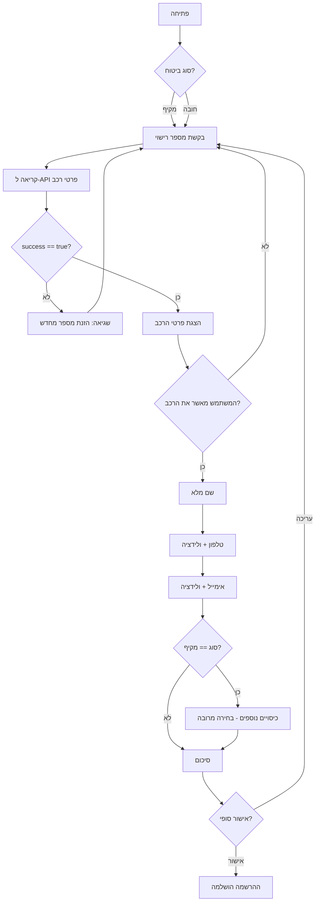

# מסמך הסבר — Insait Home Assignment

מסמך זה מתאר את הפתרון למטלת הבית: בניית API לקבלת פרטי רכב לפי מספר רישוי (חלק א'),
וכן את לוגיקת השיחה שנבנתה בפלטפורמת Insait (חלק ב').

**כתובת השירות החי:** https://vehicle-info-api-154303237856.us-central1.run.app
(תיעוד אינטראקטיבי בכתובת `/docs`).

---

## 1. תיאור הלוגיקה (חלק א')

השירות מקבל מספר רישוי ישראלי ומחזיר את פרטי הרכב: יצרן, דגם, שנה וצבע. הזרימה הפנימית
לכל בקשה היא קצרה וברורה:

1. **קבלת הבקשה** — בקשת `POST /vehicle-info` עם גוף JSON בצורת `{"license_plate": "12345678"}`.
2. **ולידציה** — מספר הרישוי נבדק בשכבת הליבה (Domain): נדרשת מחרוזת ספרתית באורך 7–8 ספרות.
   קלט לא תקין נדחה מיד, לפני כל פנייה למקור הנתונים.
3. **שליפת הנתונים** — ה-Use Case פונה ל-Repository (מקור הנתונים) ומבקש את הרכב לפי המספר.
4. **החזרת התשובה** — אם נמצא רכב, הוא מוחזר במעטפת הצלחה אחידה. אם לא נמצא, מוחזרת
   שגיאת "לא נמצא" במעטפת שגיאה זהה במבנה.

כל תשובה — הצלחה או כישלון — עוטה את אותו מבנה מעטפת עם השדה `success`, כך שכל צרכן (ובמיוחד
מנוע השיחה של Insait) יכול להסתעף על שדה בוליאני יחיד.

מבנה ההצלחה:

```json
{ "success": true, "data": { "license_plate": "12345678", "manufacturer": "טויוטה",
  "model": "קורולה", "year": 2020, "color": "לבן" } }
```



*תמונה 1: קריאת `POST /vehicle-info` מוצלחת ב-Swagger UI — תשובת 200 עם פרטי הרכב.*

מבנה השגיאה:

```json
{ "success": false, "error": { "code": "VEHICLE_NOT_FOUND", "message": "..." } }
```

---

## 2. החלטות תכנון

### 2.1 ארכיטקטורה משושה (Hexagonal / Ports & Adapters)

בחרתי בארכיטקטורה משושה כדי להפריד בין ליבת הלוגיקה לבין הטכנולוגיה שמסביבה. המערכת מחולקת
לארבע שכבות, כאשר כלל התלות הוא חד-כיווני ופנימה בלבד:

- **`domain`** — הליבה הטהורה: ישות `Vehicle`, חוקי ולידציה של מספר רישוי, חריגות (Exceptions),
  ושני "פורטים" (ממשקים מופשטים): פורט יוצא `VehicleRepository` (מאיפה מגיעים הנתונים) ופורט
  נכנס `GetVehicleInfo` (מה האפליקציה יודעת לעשות). שכבה זו אינה מייבאת שום פריימוורק.
- **`application`** — ה-Use Case `GetVehicleInfoUseCase`: מאמת את המספר, פונה ל-Repository,
  ומחזיר רכב או זורק חריגה. תלוי אך ורק ב-`domain`.
- **`infrastructure`** — מימושים קונקרטיים מאחורי הפורט היוצא: `InMemoryVehicleRepository`
  (ברירת המחדל, עם נתוני דמו) ו-`HttpVehicleRepository` (אופציונלי, פונה למקור חיצוני). וכן
  קונפיגורציה.
- **`api`** — שכבת ה-HTTP: סכמות בקשה/תשובה, ניתוב, הזרקת תלויות, ומטפלי שגיאות.

**היתרון המעשי:** הפורט היוצא מאפשר להחליף את מקור הנתונים (מ-mock למרשם רכב אמיתי) בלי לגעת
בליבה או בשכבת ה-API — רק מוסיפים adapter חדש. הדבר מודגם על ידי קיומם של שני מימושים לאותו
פורט. כלל התלות נאכף ונבדק בכל שלב.

### 2.2 מעטפת תשובה אחידה

כל מסלולי הכישלון (לא נמצא, ולידציה, שגיאה כללית) ממופים למבנה מעטפת אחד עם `success: false`
ואובייקט `error` הכולל `code` ו-`message`. הסיבה: מנוע השיחה של Insait מסתעף בקלות על שדה
בוליאני אחד (`api_success`), במקום לפענח מבני שגיאה שונים לכל סוג כשל. גם תקלת ולידציה של
FastAPI עצמה נתפסת וממופה למעטפת זו, כך ששום מבנה שגיאה "גולמי" אינו דולף החוצה.

### 2.3 ולידציה בשתי שכבות

הולידציה הסמכותית נמצאת ב-API (בצד השרת). בנוסף, בצד זרימת השיחה ניתן להוסיף ולידציה מקדימה
(למשל פורמט מספר) למשוב מהיר למשתמש. השרת הוא תמיד מקור האמת.

### 2.4 פריסה ל-Cloud Run

השירות ארוז ב-Docker (`python:3.12-slim`, האזנה ל-`$PORT`) ונפרס ל-Google Cloud Run. השתמשתי
ב-`--allow-unauthenticated` כדי שה-webhook של Insait יוכל לפנות לשירות, וב-`--min-instances 1`
כדי לצמצם השהיית "קור" (cold start).

### 2.5 אינטגרציה עם מרשם הרכב הארצי (data.gov.il)

ברירת המחדל היא `InMemoryVehicleRepository` — מאגר בזיכרון עם נתוני דמו, שמספק הדגמה צפויה
ויציבה וללא תלות ברשת. לצידו, `DataGovVehicleRepository` מממש את אותו פורט `VehicleRepository`
מול מרשם הרכב הממשלתי הפתוח של data.gov.il. המעבר בין שני המקורות נעשה דרך משתנה הסביבה
`REPOSITORY=http` בלבד — ללא שינוי כלשהו בשכבות `domain` / `application` / `api`. זו בדיוק
התועלת של הארכיטקטורה המשושה: החלפת מקור הנתונים ממוקדת ב-adapter יחיד.

מיפוי השדות ממבנה המרשם לישות `Vehicle`:

| שדה במרשם | שדה ב-`Vehicle` |
|---|---|
| `mispar_rechev` | `license_plate` |
| `tozeret_nm` | `manufacturer` |
| `kinuy_mishari` | `model` |
| `shnat_yitzur` | `year` |
| `tzeva_rechev` | `color` |

המיפוי אומת מול ה-API החי באמצעות מספר רישוי אמיתי.



*תמונה 7: שליפת פרטי רכב אמיתי ממרשם data.gov.il דרך `DataGovVehicleRepository` (`REPOSITORY=http`).*

---

## 3. הסבר על אינטגרציית ה-API

חלק ב' (זרימת Insait) קורא לשירות באמצעות צומת webhook: בקשת `POST` לכתובת `/vehicle-info`
עם מספר הרישוי שהמשתמש הזין. השירות מחזיר את המעטפת האחידה, והזרימה קוראת את `success`:

- אם `success == true` — הזרימה ממלאת משתנים (`vehicle_manufacturer`, `vehicle_model`,
  `vehicle_year`, `vehicle_color`) ומציגה אישור פרטי רכב.
- אם `success == false` — הזרימה עוברת למסלול "לא נמצא" ומבקשת מהמשתמש להזין מספר מחדש.

ההסתעפות מתבצעת על שדה בוליאני יחיד, וזה בדיוק היתרון של המעטפת האחידה.

---

## 4. מקרי קצה (Edge Cases)

1. **רכב לא נמצא (Not Found).** מספר תקין בפורמט שאינו קיים במאגר (למשל `00000000`) מחזיר
   `404` עם `code: VEHICLE_NOT_FOUND`. הזרימה מזהה `success == false` ומבקשת מספר מחדש.
2. **קלט לא תקין (Validation).** מחרוזת לא ספרתית (`abc`), ריקה, או באורך שגוי (`123`) מחזירה
   `422` עם `code: VALIDATION_ERROR` — עוד לפני פנייה למאגר. כך נחסכת עבודה מיותרת והמשתמש מקבל
   הודעה ברורה.
3. **מקור הנתונים נופל / timeout (API down).** במימוש ה-HTTP, פנייה לשירות חיצוני עלולה
   להיכשל או לקרוס בזמן. שגיאה בלתי צפויה נתפסת על ידי מטפל ה-Exception הכללי וממופה ל-`500`
   עם `code: INTERNAL_ERROR`, שוב באותה מעטפת אחידה — כך שגם תקלה זו אינה שוברת את הזרימה.

להלן צילומי מסך הממחישים את מקרי הקצה:


*תמונה 2: מקרה קצה "רכב לא נמצא" — מספר `00000000` מחזיר `404` עם `VEHICLE_NOT_FOUND`.*


*תמונה 3: מקרה קצה "קלט לא תקין" — מחרוזת לא ספרתית (`abc`) מחזירה `422` עם `VALIDATION_ERROR`.*



*תמונה 4: מקרה קצה "קלט לא תקין" — מספר קצר מדי (`123`) מחזיר `422` עם `VALIDATION_ERROR`.*



*תמונה 5: הרצת מקרי הקצה דרך הטרמינל (curl) — הצלחה, "לא נמצא", וקלט לא תקין.*

כל ההתנהגויות הללו ננעלות בחבילת הבדיקות האוטומטית (pytest):



*תמונה 6: הרצת חבילת הבדיקות — כל הבדיקות עוברות.*

---

## 5. זרימת השיחה (חלק ב')

הזרימה נבנתה ידנית בעורך של platform.insait.io.

**משתנים:** `insurance_type` (comprehensive | mandatory), `license_plate`,
`vehicle_manufacturer`, `vehicle_model`, `vehicle_year`, `vehicle_color`, `api_success` (בוליאני),
`full_name`, `phone`, `email`, `coverages` (בחירה מרובה).

**תנאים / ניתוב:**
- אחרי קריאת ה-API: `api_success == true` → אישור פרטי רכב; אחרת → מסלול "לא נמצא" (הזנת מספר מחדש).
- לפני הסיכום: `insurance_type == comprehensive` → הצגת שלב כיסויים; אחרת → דילוג ישירות לסיכום.



*התרשים שלמעלה (Mermaid) הוא הגרסה המפושטת לצורכי הסבר. להלן הזרימה כפי שנבנתה בפועל בפלטפורמת
Insait, ולאחריה הקלטת ריצה מלאה מקצה לקצה.*



*תמונה 8: דיאגרמת זרימת השיחה המלאה כפי שנבנתה בעורך של Insait.*

<video src="screenshots/full-agent-flow-video.webm" controls width="640"></video>

[צפייה / הורדה של הסרטון: full-agent-flow-video.webm](screenshots/full-agent-flow-video.webm)

*סרטון: הקלטת מסך של ריצה מלאה מקצה לקצה בזרימת Insait (אם הווידאו אינו מוטמע, השתמשו בקישור שמעל).*
